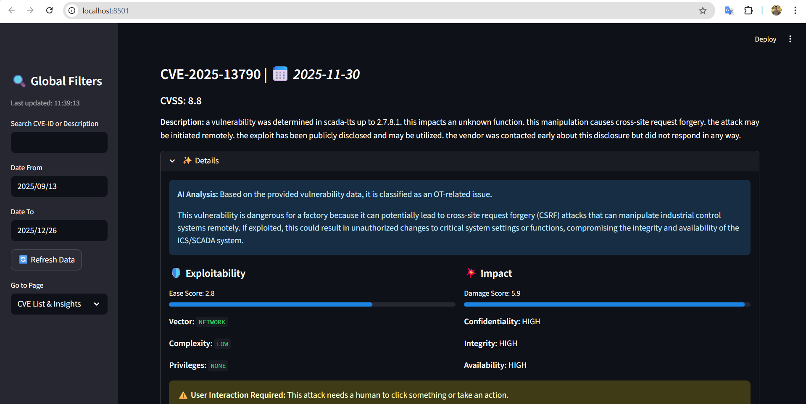
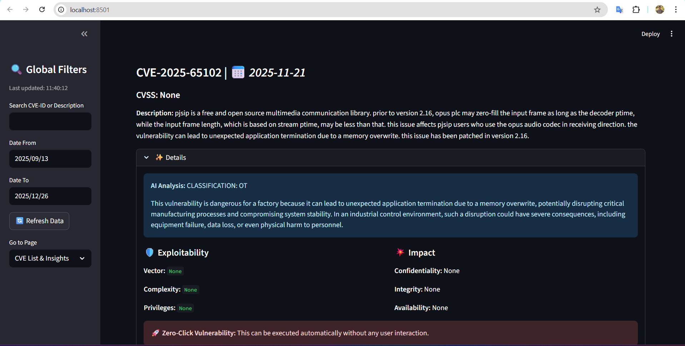
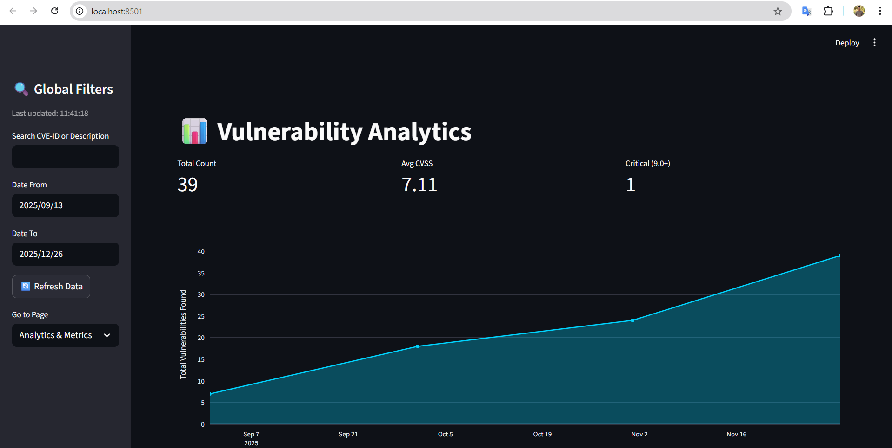
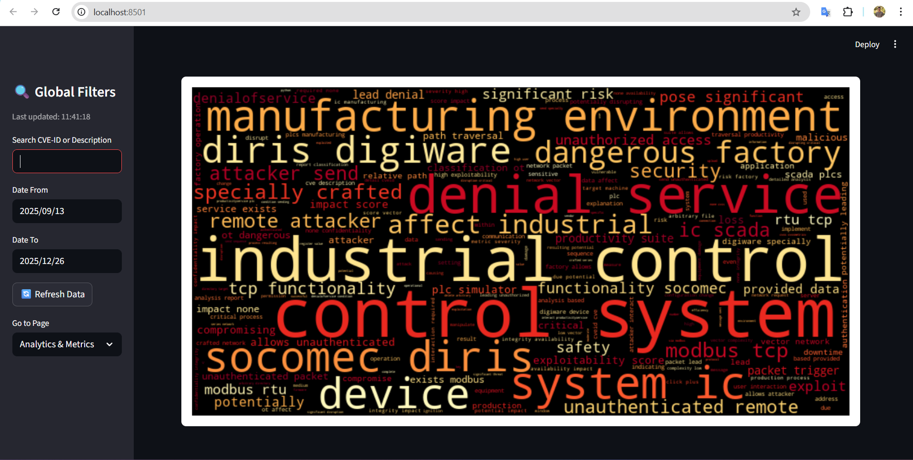

# 🛡️ Automated Threat Intelligence Agent
## 🚀 How to run the code ?
1. You must have Python 3.11.7 or higher
2. 1. Install the following packages.
```bash
pip freeze > requirements.txt
```
3. For LLM, I used Ollama  locally from https://ollama.com/
Then installed the model that I used (llama3.2) by typing in the terminal
```bash
ollama pull llama3.2
```
4. Finally, execute `scripts/init.py` for the first time only once to get some historical OT data.

5. To make a schedule script to run every 10 minutes to get the latest data, just type (for Windows):
```bash
./run.ps1
```
6. To see the dashboard, just run:
```bash
cd streamlit
streamlit run main.py
```

## 🧠 Prompt/logic used
In this section, I will talk about how I designed the prompt for the LLM model to be able to produce accurate results:
1. I assigned it the role of an OT expert to analyze the vulnerabilities.
```
You are an OT Cybersecurity Expert. Analyze the following vulnerability.
```
Then gave it other 2 steps:

2. Step1: Second filter, if it is IT related, only state `CLASSIFICATION: IT` so we can exclude, otherwise it is OT related and will continue to the next step.
```
Step 1: Determine if this vulnerability affects Industrial Control Systems (ICS), SCADA, PLCs, or manufacturing environments. If it is strictly a standard IT issue (e.g., web browsers, office software), state 'CLASSIFICATION: IT' only and stop.
```

3. Step 2: analyze "why this CVE is dangerous for the factory ?"
```
Step 2: If it is OT-related, provide a formal 2-sentence explanation of "why this is dangerous for a factory ?".
```

4. Gave the model all the data it needs or help for analysis, the data includes:
  - CVE-ID (So that if the model is fine-tuned on new data, it can give rich information, better if the LLM model operates on the cloud).
  - Description.
  - Metrics (related to risks and impact, helped a lot), Ex:
```
Vulnerability Data:
    - CVE-ID: {cve_id}, 
    - Description: {description}
    - Metrics: {cvss_details}
```
```json
        "metrics": {
            "baseSeverity": "HIGH",
            "exploitabilityScore": 2.8,
            "impactScore": 5.9,
            "vector_attack": "NETWORK",
            "vector_complexity": "LOW",
            "vector_auth": "NONE",
            "confidentialityImpact": "HIGH",
            "integrityImpact": "HIGH",
            "availabilityImpact": "HIGH",
            "userInteractionRequired": "REQUIRED",
            "cvssVersion": "cvssMetricV31"
        }
```

5. Modified the attitude of the output:
```
Make your tone formal as the results will be displayed in a website, not personal to me.
```

6. If one of the metrics' details was null, I filled it with `None`, not `0`, for example, as this will affect the model reasoning.

7. The model is loaded one at the beginning at operates separatly on each record in the loop.

## 🏗️ Architecture Diagram
<div align="center">
  
</div>

## 👨‍💻 Technical Explanation
### Searching and planning
In the first place, I read the NVD API documentation on: https://nvd.nist.gov/developers/vulnerabilities, and got an API key.

It is important to note that there are 3 different schema versions, as this affected parsing the data:
- [CVEv3.1 schema](https://csrc.nist.gov/schema/nvd/api/2.0/external/cvss-v3.1.json)
- [CVEv3.0 schema](https://csrc.nist.gov/schema/nvd/api/2.0/external/cvss-v3.0.json)
- [CVEv2.0 schema](https://csrc.nist.gov/schema/nvd/api/2.0/external/cvss-v2.0.json)

I also read the parameters of the API and found:
- `keywordSearch`: Returns only the CVEs where a word or phrase is found in the current description. (No OR option AND only).
- `pubStartDate` & `pubEndDate`: Maximum range is 120 days.
- `resultsPerPage`: The maximum number of CVE records to be returned in a single API response. (maximum is 2000).
- `startIndex`: From where to start the search (zero-based).

This is information that helped me.

---

### Fetching the data and prefiltering
As mentioned, we can use `keywordSearch` to get only CVEs that contain a specific word.

As there is no `OR` option, I created a loop to go through each keyword and make a separate `GET` request, then combine all.

```python
for kw in self.keywords:
  part = self._load(keyword=kw)
  cves.extend(part)
```

The keywords that I used are:
```python
self.keywords = [
    # mentioned in the task (pdf)
    "scada", "plc", "hmi", "siemens", "rockwell", "schneider",
    "modbus", "dnp3"

    # we can add more keywords later
  ]
```

This is extremely faster and more optimized than getting all the data, then applying a regex, for example, or a keyword search on the data. Also, the usage of the API params gives more reliable and accurate results.

This is also better than pushing large data to the LLM model, which will consume huge resources.

##### URL params
- `pubEndDate`: Default is now, and can be changed.
- `pubStartDate`: pubEndDate - Interval (Configurable, in minutes).
- `resultsPerPage`: 2000
- `keywordSearch`

---

### Scheduling

---

### Parsing data
Here, I parsed, extracted the data from the returned JSON object. Also handled missing values.

I ensured the different schemas as mentioned above. (Difference in metrics parsing only, easily solved by conditions).

I apply the second filtering mechanism here in the loop.
```python
# LLM work
ai_response = self.get_local_ai_insight(
  cve_id, 
  description_conactenated_en, 
  cvss_score,
  cvss_details)

# additional filtering from LLM
if 'CLASSIFICATION: IT' in ai_response.upper():
  continue

# => append was discarded
```

Example of final parsed data:
```json
"CVE-2025-13790": {
        "cvss_score": 8.8,
        "original_description": "a vulnerability was determined in scada-lts up to 2.7.8.1. this impacts an unknown function. this manipulation causes cross-site request forgery. the attack may be initiated remotely. the exploit has been publicly disclosed and may be utilized. the vendor was contacted early about this disclosure but did not respond in any way.",
        "publish_date": "2025-11-30T15:15:46.003",
        "ai_response": "Based on the provided vulnerability data, it is classified as an OT-related issue.\n\nThis vulnerability is dangerous for a factory because it can potentially lead to cross-site request forgery (CSRF) attacks that can manipulate industrial control systems remotely. If exploited, this could result in unauthorized changes to critical system settings or functions, compromising the integrity and availability of the ICS/SCADA system.",
        "metrics": {
            "baseSeverity": "HIGH",
            "exploitabilityScore": 2.8,
            "impactScore": 5.9,
            "vector_attack": "NETWORK",
            "vector_complexity": "LOW",
            "vector_auth": "NONE",
            "confidentialityImpact": "HIGH",
            "integrityImpact": "HIGH",
            "availabilityImpact": "HIGH",
            "userInteractionRequired": "REQUIRED",
            "cvssVersion": "cvssMetricV31"
        }
    }
```

I chose to select more data, such as metrics, as I found that I enhanced the analysis and reasoning of the LLM.

---

### LLM and reasoning + second filteration (described above)
The prompt logic was described above, and the application of the second filtering was also described.

The LLM model runs locally one:
```
http://localhost:11434/api/generate
```

---

### Storing as JSON
If there is old data, it will be saved in `scripts/cve_data.json`.

It is in the form of python dictionary, and the keys are CVE-ID to ensure that there will not be any repeated data, and also to take advantage of a hashtable.

---

### Streamlit Dashboard
There are 2 main pages:
#### Page to list the updated OT vulnerabilities.
<div align="center">
  
  
</div>

#### Page for general analysis.
##### Cummulative count of OT vulnerabilites (month scale)
<div align="center">
  
</div>

##### Word cloud to see easily determine the most critical casuses, types of vulnerabilities 
<div align="center">
  
</div>

The dashboard also has other features like:
- Easy filtering by: date, search by CVE-ID, or description.
- Auto refresh every 10 min.
- A button to refresh manually.
